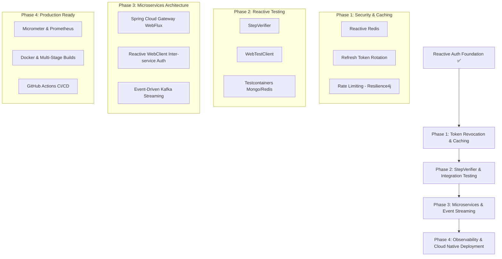

# Beyond Basic Auth: Java Reactive Microservices Learning Roadmap

Now that you have built a **Reactive Authentication System** using Spring Boot 3 (WebFlux), Spring Security 6 (Reactive), Reactive MongoDB, and JWTs, here is your clear roadmap for what to learn next to become a **Senior Reactive Java & Microservices Backend Engineer**.

---

## 🗺️ Learning Roadmap Overview

---

## 🚀 Detailed Phase Breakdown

### 📍 Phase 1: Security Hardening & Reactive Caching (Immediate Next Step)

| Module | Core Concept | Technology | Why You Need It |
| :--- | :--- | :--- | :--- |
| **Refresh Tokens** | Short-lived Access Tokens (15m) + Long-lived Refresh Tokens (7d) stored in DB/Redis | JWT + Reactive MongoDB / Redis | Fixes security flaws of standalone JWTs (allows revoking compromised sessions). |
| **Reactive Caching** | High-performance session storage & token blacklisting | `ReactiveRedisTemplate` (Spring Data Redis Reactive) | Instant token invalidation on logout without DB load. |
| **Rate Limiting** | Prevent Brute Force & DDoS on `/api/v1/auth/login` | Bucket4j / Resilience4j | Protects backend against abuse. |
| **OAuth2 Social Auth** | "Sign in with Google / GitHub" | `spring-boot-starter-oauth2-client` (WebFlux) | Standard for modern customer authentication. |

---

### 📍 Phase 2: Reactive Testing & Quality Assurance

| Module | Core Concept | Technology | Why You Need It |
| :--- | :--- | :--- | :--- |
| **Reactive Unit Testing** | Test asynchronous `Mono` / `Flux` without blocking threads | `StepVerifier` (Reactor Test framework) | Validates reactive streams, backpressure, and error emissions accurately. |
| **Endpoint Testing** | Non-blocking HTTP assertion | `WebTestClient` | Tests controllers end-to-end without launching an HTTP server overhead. |
| **Integration Testing** | Spin up real MongoDB & Redis in Docker during JUnit tests | Testcontainers | Guarantees test accuracy against real database engines rather than mocks. |

---

### 📍 Phase 3: Microservices & Event-Driven Architecture

| Module | Core Concept | Technology | Why You Need It |
| :--- | :--- | :--- | :--- |
| **API Gateway** | Unified entry point, SSL termination, Global JWT Verification | Spring Cloud Gateway (WebFlux based) | Decouples authentication from domain services (Order, Payment, User Profile). |
| **Inter-Service Communication** | Async HTTP calls passing JWT headers | `WebClient` | Non-blocking microservice-to-microservice REST calls. |
| **Event Streaming** | Publish `UserRegisteredEvent` asynchronously | Apache Kafka / Project Reactor Kafka | Triggers email notifications, analytics, and user initialization without blocking auth endpoints. |

---

### 📍 Phase 4: Production Observability & Cloud Native Deployment

| Module | Core Concept | Technology | Why You Need It |
| :--- | :--- | :--- | :--- |
| **Metrics & Tracing** | Track request latency across microservices | Micrometer + Zipkin / Jaeger + Prometheus | Instantly pinpoint bottlenecks and failing services. |
| **Containerization** | Containerize WebFlux app into lightweight image | Multi-stage `Dockerfile` (Alpine/Distroless) | Consistent deployment across Dev, Staging, and Production. |
| **Orchestration & CI/CD** | Automated build, test, image push, and compose execution | Docker Compose + GitHub Actions | Automated quality gates before code hits production. |

---

## 🎯 Recommended Next Practical Project

Build a **Microservice Suite**:
1. **Auth Service** (*What you just built*): Issues JWTs and handles registration/login.
2. **API Gateway**: Intercepts requests, validates JWTs, routes requests to downstream services.
3. **Notification Service**: Listens to Kafka topic `user-registered` published by Auth Service and logs/sends a welcome notification.
4. **User Profile Service**: Serves profile data using `WebClient` to fetch user details.

---

## 📄 Next Action Items Checklist

- [ ] Implement **Refresh Token Flow** (`POST /api/v1/auth/refresh`)
- [ ] Add **Logout Endpoint** with Redis Token Blacklisting
- [ ] Write unit tests for `AuthService` using `StepVerifier`
- [ ] Containerize the app with a production-ready `Dockerfile` and `docker-compose.yml`
