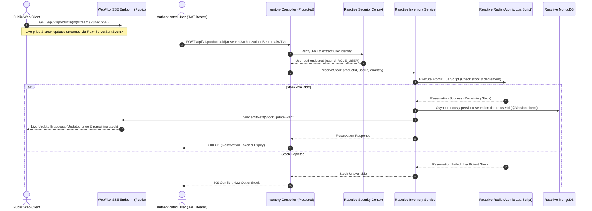

# Real-Time Reactive Inventory & Dynamic Pricing System ⚡📦

A high-concurrency, non-blocking backend engine designed for flash-sale scenarios, atomic inventory reservations, and live price/stock streaming using **Spring Boot 3 (WebFlux)**, **Project Reactor**, **Reactive Redis**, and **Reactive MongoDB**.

---

## 🚀 Key Highlights

- **Zero Over-Selling Guarantee**: Atomic inventory checks and decrements executed inside Redis via custom **Lua scripts**, eliminating race conditions during high-concurrency flash sales.
- **Real-Time Data Streaming**: Pushes live inventory levels and dynamic price updates directly to connected clients using **Server-Sent Events (SSE)** via Project Reactor's `Flux<ServerSentEvent<T>>` and `Sinks.Many`.
- **Dynamic Pricing Engine**: Automatically recalculates product prices on-the-fly based on real-time stock velocity, supply ratios, and demand surges.
- **End-to-End Reactive Stack**: 100% asynchronous, non-blocking I/O pipeline from HTTP layer (WebFlux) down to Redis and MongoDB.
- **Stateless Reactive Security**: Custom Spring Security Reactive filter chain with **JWT (JSON Web Token)** authentication and role-based access control (RBAC).
- **Optimistic Concurrency Control**: Syncs reserved stock to persistent MongoDB storage with `@Version` annotations to prevent database-level conflict anomalies.

---

## 🛠️ Languages, Tools & Tech Stack

| Category | Technology | Description |
| :--- | :--- | :--- |
| **Language** | **Java 17** | Modern LTS Java leveraging records, enhanced switch expressions, and pattern matching. |
| **Framework** | **Spring Boot 3.2.5** | Core application framework configured for reactive execution. |
| **Reactive Core** | **Spring WebFlux & Project Reactor** | Event-driven, non-blocking runtime utilizing Netty, `Mono`, `Flux`, and `Sinks`. |
| **In-Memory & Cache** | **Reactive Redis (Lettuce)** | High-speed cache and atomic locking engine executing Lua scripts. |
| **Database** | **Reactive MongoDB** | Asynchronous document storage for user profiles and product catalogs. |
| **Security & Auth** | **Spring Security 6 + JJWT (0.12.5)** | Reactive security context, BCrypt password hashing, stateless JWT authentication. |
| **Build Tool** | **Gradle** | Dependency management, build automation, and compiler parameter support. |
| **Code Generation** | **Lombok** | Boilerplate reduction for models, builders, and loggers. |
| **Validation** | **Jakarta Validation (Hibernate Validator)** | Request payload validation with reactive error binding. |
| **API Testing** | **Postman Collections** | Pre-configured environment and collections for Auth & Inventory flows. |

---

## 🏗️ System Architecture & Data Flow



---

## 📁 Project Structure

```text
├── src/main/java/com/example
│   ├── auth/                        # Reactive Authentication Module
│   │   ├── config/                  # Reactive Security Configuration
│   │   ├── controller/              # Auth & Registration Endpoints
│   │   ├── dto/                     # Auth Request / Response DTOs
│   │   ├── exception/               # Global Reactive Exception Handlers
│   │   ├── model/                   # User and Role Domain Entities
│   │   ├── repository/              # Reactive MongoDB User Repository
│   │   ├── security/                # JWT Utilities & Authentication Filter
│   │   └── service/                 # Reactive User & Token Service
│   │
│   └── inventory/                   # Real-Time Inventory & Pricing Engine
│       ├── config/                  # Reactive Redis & Lua Script Configuration
│       ├── controller/              # REST Endpoints & SSE Streaming Controller
│       ├── dto/                     # Reservation & Stock Event Payloads
│       ├── model/                   # Product Entity with Optimistic Locking
│       ├── repository/              # Reactive Mongo Product Repository
│       └── service/                 # Lua Reservation, Dynamic Pricing & SSE Broadcaster
│
├── Reactive_Auth_API.postman_collection.json         # Auth Test Suite
├── Realtime_Inventory_System.postman_collection.json  # Inventory & SSE Test Suite
├── Realtime_Inventory_System.postman_environment.json # Postman Environment Config
├── build.gradle                                       # Gradle Dependencies & Tasks
└── README.md
```

---

## 🚦 Getting Started

### Prerequisites
- **Java 17 JDK** or higher
- **Redis Server**
- **MongoDB**

### Build & Run

```bash
# Build the application
./gradlew build

# Run application locally
./gradlew bootRun
```

---

## 🧪 Testing

Run automated tests via Gradle:

```bash
./gradlew test
```
