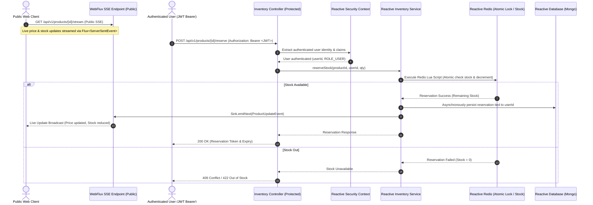

# Real-Time Inventory & Dynamic Pricing Engine: Implementation Roadmap

Welcome to the **Real-Time Inventory & Dynamic Pricing System** project! This project focuses on high-concurrency backend engineering, reactive data streaming, atomic inventory management, and flash-sale race condition prevention using **Spring Boot 3 (WebFlux)**, **Reactive Redis**, **Project Reactor (`Flux`/`Mono`/`Sinks`)**, and **Server-Sent Events (SSE)**.

---

> ⚠️ **STRICT METHODOLOGY RULE**:
> We build **Step-by-Step, 1 File Per Instruction / Turn**.
> We will **NEVER** create a bunch of files at once. Every file is created, explained, and verified interactively so you learn every concept thoroughly before moving to the next line of code!

---

## 🎯 Core Technical Goals

1. **Atomic Flash-Sale Reservation**: Guarantee **zero over-selling** when thousands of concurrent users attempt to purchase limited stock simultaneously using Redis Lua scripts & atomic operations.
2. **Real-Time Streaming**: Stream live inventory updates & price fluctuations directly to client browsers using **Server-Sent Events (`Flux<ServerSentEvent<T>>`)**.
3. **Dynamic Pricing Algorithm**: Automatically calculate price surges/discount drops based on current stock velocity and demand flux.
4. **Optimistic Locking Persistence**: Sync reserved stock from Redis cache to MongoDB/Database with `@Version` control to handle conflicts gracefully.

---

## 🏗️ System Architecture & Data Flow

---

## 📌 Master File Creation Sequence

| Step | File Path | Purpose | Security / Key Concept |
| :---: | :--- | :--- | :--- |
| **01** | `src/main/java/com/example/inventory/model/Product.java` | Product Entity / Document | Includes `@Id`, `basePrice`, `currentPrice`, `availableStock`, `@Version` |
| **02** | `src/main/java/com/example/inventory/dto/StockUpdateEvent.java` | Real-time event DTO emitted to SSE clients | `productId`, `currentPrice`, `remainingStock`, `timestamp` |
| **03** | `src/main/java/com/example/inventory/dto/ReservationRequest.java` | Request payload for flash-sale item reservation | Input validation (`@Min`, `@NotNull`) |
| **04** | `src/main/java/com/example/inventory/dto/ReservationResponse.java` | Response DTO returning reservation status & token | `success`, `message`, `reservationToken`, `expiry` |
| **05** | `src/main/java/com/example/inventory/config/RedisConfig.java` | Reactive Redis configuration | `ReactiveRedisTemplate<String, String>` & Lua script loader |
| **06** | `src/main/java/com/example/inventory/repository/ProductRepository.java` | Reactive Repository for Mongo | `ReactiveMongoRepository` with custom query methods |
| **07** | `src/main/java/com/example/inventory/service/DynamicPricingService.java` | Calculates price surges based on inventory ratios | Reactive calculation (`Mono<BigDecimal>`) |
| **08** | `src/main/java/com/example/inventory/service/InventoryEventBroadcaster.java` | Reactive event stream sink manager | `Sinks.Many<StockUpdateEvent>` multi-cast broadcasting |
| **09** | `src/main/java/com/example/inventory/service/InventoryService.java` | Business logic for atomic stock reservation | Lua script execution + Redis + MongoDB persist |
| **10** | `src/main/java/com/example/inventory/controller/InventoryController.java` | WebFlux REST Controller & SSE Streaming Endpoints | Security: Public SSE & GETs, `@PreAuthorize("hasRole('USER')")` for `/reserve` |

---

## 💡 What You Will Learn & Master

1. **Redis Atomic Lua Scripts**: How to write and execute Lua scripts inside Redis via `ReactiveRedisTemplate` to execute stock check + stock decrement as a single atomic operation.
2. **Server-Sent Events (SSE)**: Pushing live data updates to frontend applications without polling overhead.
3. **Reactor Sinks (`Sinks.many().multicast()`)**: Pub/Sub pattern inside Spring WebFlux to broadcast messages to multiple connected streams.
4. **Optimistic Concurrency Control**: Handling database write conflicts gracefully when syncing cache to database under heavy load.
